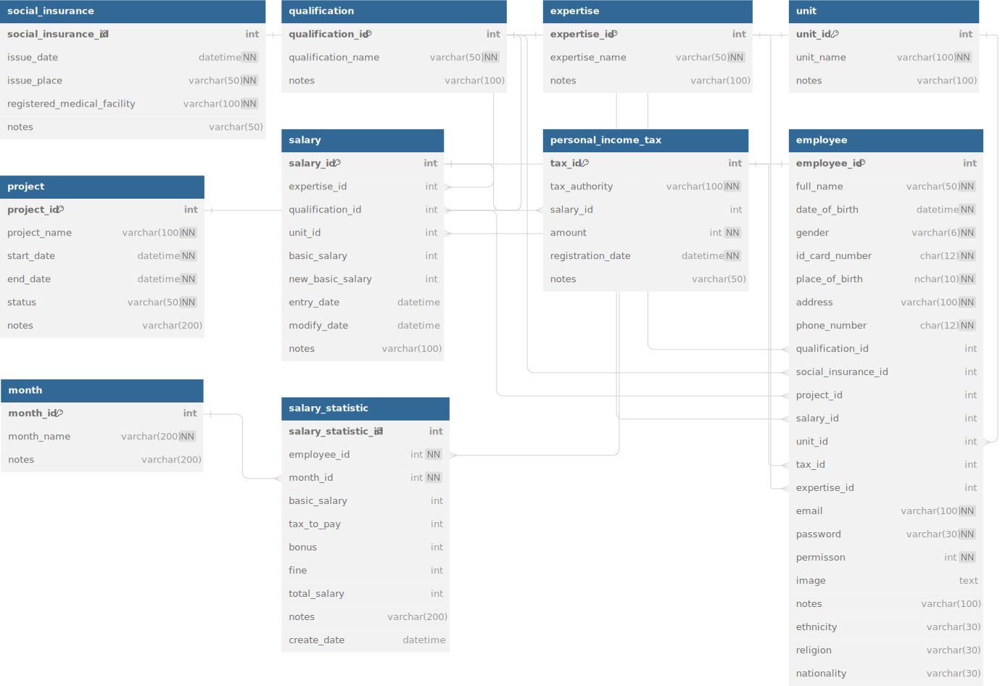

# Human Resource Management System

# Prerequisites
- .NET SDK 8.0
- Visual Studio 2022+
- Microsoft SQL Server 2019+

## Database
<details>
  <summary>Database</summary>

  <div style="margin-top: 20px">
    <a href="https://github.com/GoldStarPro/SWP391_Group2">
      
    </a>
  </div>
</details>

## Preview
<details>
  <summary>Admin page</summary>
</details>

<details>
  <summary>Employee page</summary>
</details>

## Installation

#### Clone this repository
```bash
git clone https://github.com/GoldStarPro/SWP391_Group2.git
```

#### Set up database:
- On the Database folder, open the script SQL_Query_HR_Management.sql on SQL Server Management Studio
- Press Ctrl A and then click Execute to run the script.

#### Initialize the project:
- Open HR_Management.sln in Visual Studio
- Change Server in ConnectionStrings in HRManagementContext.cs and appsettings.json file to match with your server that set up database HR_Management in SSMS.
- Build this project and run.

### Access `Human Resource Management System`:
- Open `http://localhost:29604` in your browser.

## Contributors:

<table>
  <tr>
    <td align="center"><a href="https://github.com/GoldStarPro" style="text-decoration: none";><br /><sub><b>Trần Huy Hoàng</b></sub></a></td>
    <td align="center"><a href="https://github.com/thy03"><br /><sub><b>Lê Việt Thy</b></sub></a></td>
    <td align="center"><a href="https://github.com/captaintemmo11"><br /><sub><b>Phan Phương Sinh</b></sub></a></td>
    <td align="center"><a href="https://github.com/phanquocdai"><br /><sub><b>Phan Quốc Đại</b></sub></a></td>
    <td align="center"><a href="https://github.com/chienlag1"><br /><sub><b>Nguyễn Ngô Chiến</b></sub></a></td>
  </tr>
</table>


